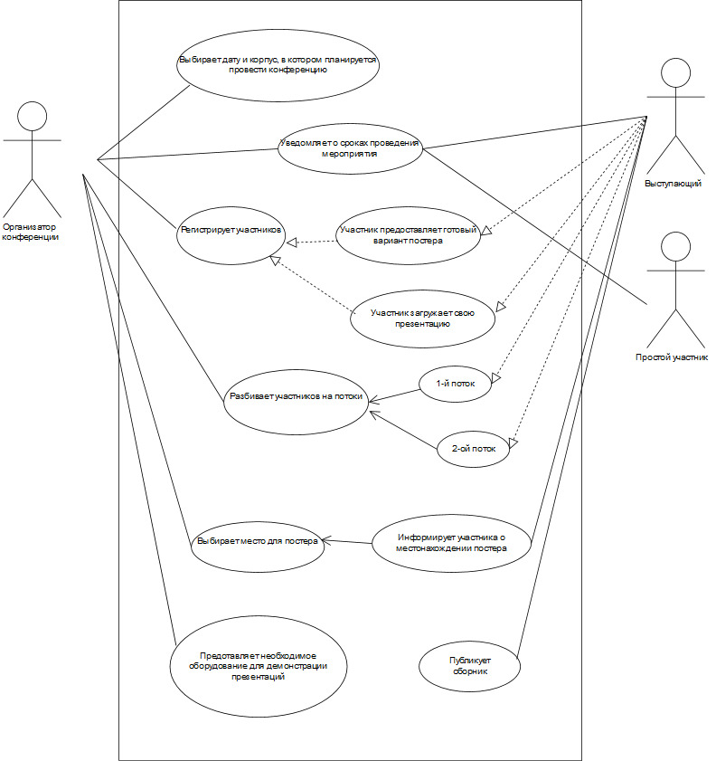
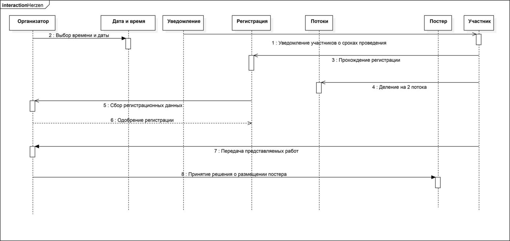

# Результаты выполнения задания

## Диаграмма прецедентов

## Диаграмма последовательности

## Ответы на вопросы

## 1. Каких бы вы привлекли специалистов для решения этой задачи?

- Специалист по информационным системам
- Администратор базы данных
- Web-разработчики FrontEnd + Backend

## 1. Как организовали бы работу в команде (роли, сроки)?

Вся работа должна вестись под руководством специалиста по информационным системам. 

**Его обязанности -- cоздание и сопровождение информационных систем:
 
  - сбор информации для моделирования предметной области проекта и требований будущих пользователей системы;
  - составление совместно с заказчиком технического задания на разработку информационной системы;
  - разработка информационной системы и взаимодействие со всеми участниками проекта в ходе работы;
  - установка и настройка прикладного программного обеспечения, необходимого для функционирования системы;
  - настройка технического оборудования, участвующего в работе системы;
  - проведение внутреннего тестирования системы с настройкой параметров;
  - выявление и устранение ошибок в процессе работы.

  **Администратор базы данных** должен контролировать заполнение информации об участниках и других моментов конференции в электронные  таблицы. Он должен извлекать информацию, присланную Web-разработчиком Backend и формирвать базы данных

  В задачи **Web-разработчика Backend** входит программная часть простого стайта для регистрации участников и отображения афиши мероприятия и контактныз данных. Он организует сбор информации о каждом участнике и отправит её администратору базы данных

  **Web-разработчик FrontEnd** сделает внешнее оформление одностраничного сайта мероприятия. Подберёт оптимальный шаблон и дизайн сайта.

  Также необходимо донести информацию о аудитории посредством социальных сетей и плакатов в корпусах университета. Такие задачи можно распределить среди возможных волонтёров или между самими организаторами мероприятия. 

## 1. Предположим вы решили использовать методологию SCRUM. Сформулируйте список задач на первые несколько спринтов.

- **1-й спринт**
- Cбор материалов для проектирования – формирование требований, изучение объекта проектирования разработка и выбор варианта концепции системы
- Анализ материалов и формирование документации – создание и утверждение технического задания. Утверждение строков проведения мероприятия

- **2-й спринт**
- Создание одностраничного сайта (макет)
- Разработка программной оболочки для сайта (создание формы регистрации, email-рассылки)

- **3-й спринт**
- Тестирование: проверка данных, полученных от формы регистрации и тестовое заполнение базы данных, проверка email-рассылки
- Тестирование: проверка FrontEnd - части сайта (адаптивность, валидация)

